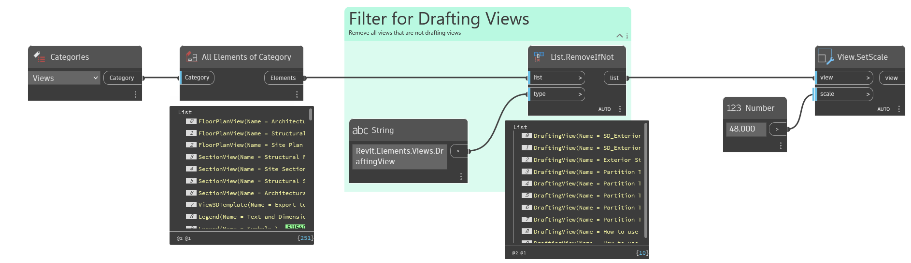

## In Depth
`View.SetScale` sets the given view to the given scale factor. For more information about changing a view's scale factor, visit this [article](https://help.autodesk.com/view/RVTLT/2024/ENU/?guid=GUID-D5DCF485-C943-4F01-93FB-1E6CA88050A7).

In the example below, all drafting views are collected from the current Revit document. The scale of the views is then set to 1/4" = 1'-0" (scale factor of 48) with `View.SetScale`.
___
## Example File

