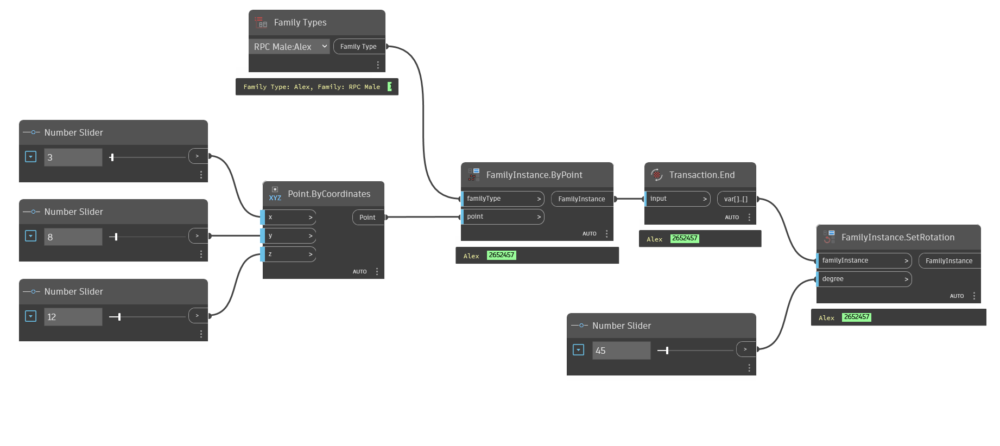

## In Depth
`Transaction.End` ends the current Dynamo transaction and returns the element that was given. In Revit transactions occur when a change happens to the Revit document. If a change has occurred, this is evident at the undo button. `Transaction.End` allows the end-user to add additional sequencing to the Dynamo graph, resulting in an undo for each step that `Transaction.End` is utilized.

In the example below, a family instance is placed in the current Revit document. `Transaction.End` is used to finish the placement before the family is rotated with `FamilyInstance.SetRotation`.

___
## Example File

